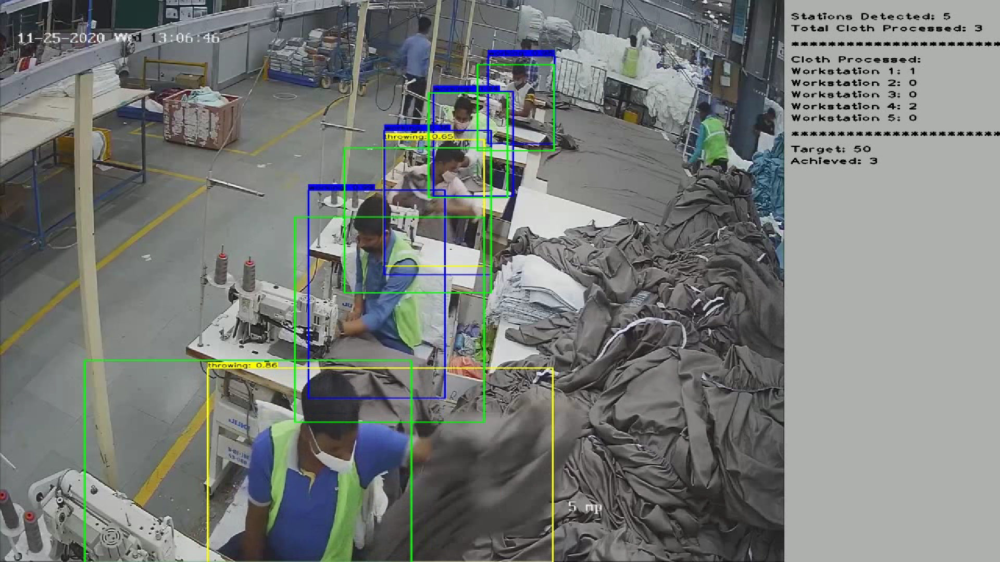

# Inventory-tracker

## _Our mission to use Automatic Tracking system to reduce the workload of client.

<a target="_blank" href="www.linkedin.com/in/aman-sharma-01b185190/">
  
</a>  <a target="_blank" href="https://www.instagram.com/aman___sharma/">
  </a>  <a target="_blank" href="mailto:aman.sharmatds1999@gmail.com"> 
  
</a>  <a target="_blank" href="https://portfolioaman.herokuapp.com/">
  
</a>  
<br>
<br>

   

## Datasets 
[The data is in video format](https://www.kaggle.com/iarunava/cell-images-for-detecting-malaria) <br>

## Table of Content
  * [Overview](#Overview)
  * [Motivation](#Motivation)
  * [Features](#Features)
  * [Samples Pictures or Demo](#Samples-Pictures-or-Demo)
  * [Video Demo](#Video-Demo)
  * [Installation and run](#Installation-and-run)
  * [Contributing](#Contributing)
  * [Directory Tree](#Directory-Tree)
  * [Tech](#Tech)
  * [Bug / Feature Request](#bug-feature-request)

## Overview
This Project use the YOLOv4 object detection Algorithm to track the Person and clothes and identify the no. of counts of Process clothes for each workstation.

## Approach

1. First we make about 200-300 frames from the video data and make a training Dataset
2. use [labelImg](https://github.com/tzutalin/labelImg) for Annotation of data and save each file in YOLO format
    
-->using LabelIMG we craete to categories 
   1. Throwing
   2. working<br>
3. Use google colab for training our data-set. For training we use YOLOv4 custom object detector with Darkent in the Cloud.<br>
4. After training save the best_weights and export our model.<br>
5. Than perform fine-tuning and optimization of model using ROI.<br>
6. Make final output video along its dashboard.

## Result

[](https://drive.google.com/file/d/14XjZad2Qmklfu9kn_vvlHg2ZhFfcrPgF/view?usp=sharing)

## Installation and run

1. Clone the repository 
```sh
git clone https://github.com/mrperfectpandit/Inventory-tracker.git
```
2.Make three folders in same path <br>

  
  👉video_data --> put the video [dataset](https://www.kaggle.com/iarunava/cell-images-for-detecting-malaria) <br>
  👉output --> will contain frames that extract from video_data by running app.py script <br>
  👉data --> put the save model that explort from saved_weights and some utils files. You will get these content in this [link](https://drive.google.com/file/d/15n4h2xpXIO3KmuZBwkXZenJWdRUniV1B/view?usp=sharing) <br>
  
  

The Code is written in Python 3.7.10. If you don't have Python installed you can find it [here](https://www.python.org/downloads/) and Tensorflow 2.3. If you are using a lower version of Python and Tensorflow you can upgrade using the pip package, ensuring you have the latest version of pip. To install the required packages and libraries, run this command in the project directory after cloning the repository:

3. Install the dependencies and devDependencies and start the server.

```sh
pip install -r requirements.txt
```

For production environments...

```sh
cd where you clone the repo
python app.py
```

## Tech
   [](https://jupyter.org/try) 
<br>


[](https://flask.palletsprojects.com/en/1.1.x/)   [](https://scikit-learn.org/stable/)   [](https://numpy.org/) 
<br>
[](https://www.tensorflow.org/install)  [](https://pypi.org/project/Keras/)  


## Contributing

1. Fork it (<https://github.com/yourname/yourproject/fork>)
2. Create your feature branch (`git checkout -b feature/fooBar`)
3. Commit your changes (`git commit -am 'Add some fooBar'`)
4. Push to the branch (`git push origin feature/fooBar`)
5. Create a new Pull Request


## Bug / Feature Request

If you find a bug (the website couldn't handle the query and / or gave undesired results), kindly open an [issue](https://github.com/mrperfectpandit/inventory-tracker/issues) here by including your search query and the expected result

